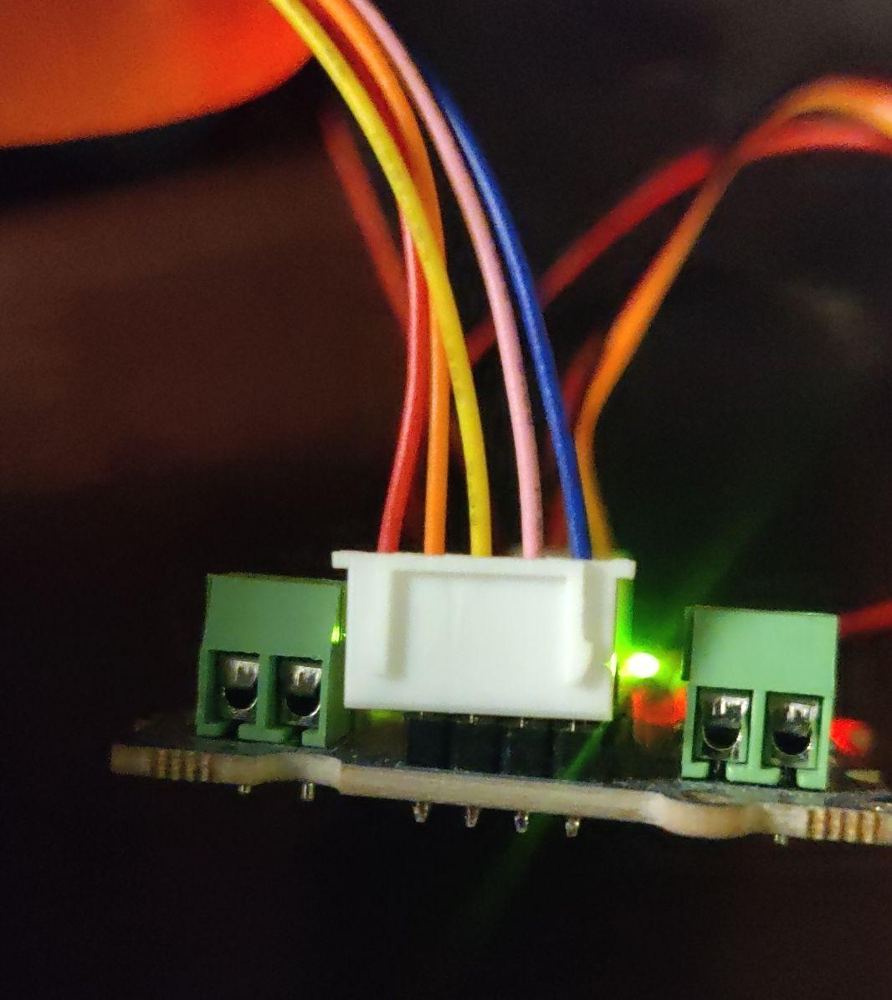
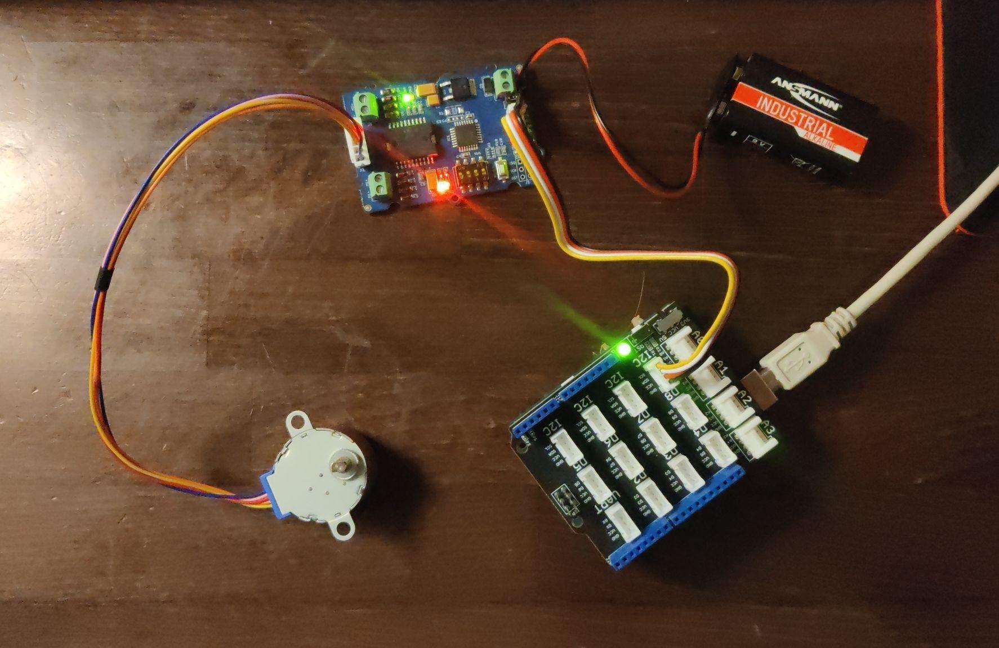

# Schrittmotor

## Beschreibung
Ein Schrittmotor wird immer mithilfe eines Motortreibers angesteuert. 
Er kann sehr genau positioniert werden, selbst ohne Sensoren, da er in einzelnen, unabhängig von äußeren Belastungen, immer gleichbleibenden Schritten weiterdreht (innerhalb der angegeben Belastungsgrenze). 
Praktisch bedeutet das: Der Mikrocontroller sendet an den Motortreiber die Richtung und die Anzahl an Schritten, die weitergedreht werden sollen. 
Solange man die Anfangsposition kennt und den Überblick der vorwärts und rückwärts gedrehten Schritten behält, ist die Position des Motors bekannt. 
Der Schrittmotor ist dadurch sehr präzise, dafür relative langsam.

Ein Schrittmotor kommt durch seine genaue und einfache Positionierbarkeit oft in der Bewegung von Maschinen oder Robotern zum Einsatz.

Weitere Informationen bezüglich der Ansteuerung sind beim [Motortreiber](/mks-welcome/part/mks-SeeedStudio-Grove_I2C_Motor_Driver_V1.3/) Beispiel `Stepper-Motor` zusammengefasst.

## Video

@[youtube](https://www.youtube.com/watch?v=wVxcmO2YuxA)

## Aufbau

1. Nehme einen [Motortreiber](/mks-welcome/part/mks-SeeedStudio-Grove_I2C_Motor_Driver_V1.3/) und schließe ihn mit einem Grove Kabel an einen `I2C` Schnittstelle des Arduinos an. 
1. Verbinden den Schrittmotor mit dem Motortreiber wie auf dem Bild. Es gibt fünf Kabel, aber nur vier Pins. Stecke es so an, wie auf dem Bild, also das rote Kabel bleibt ohne Kontakt.  

1. Schließe eine Batterie an den Motortreiber. Nehme dazu eine 9V Blockbatterie und einen Batterieklip. Es sollte in etwa so aussehen:  

1. Gehe in die Arduino IDE und klicke am linken Rand der Arduino IDE auf den Knopf mit Büchersymbol (das ist der Bibliotheksverwalter) und suche nach `Grove I2C Motor Driver`, klicke anschließend auf installieren. Das ist eine Bibliothek mit Code, damit man das den Motor leicht bedienen kann.
1. Nehme den Code von unten und lade ihn auf den Arduino. Er sollte sich jetzt abwechselnd hin- und herdrehen.

## Beispiele

!!!show-examples:./examples/

<!-- infolist -->

## Wichtige Links für die ersten Schritte:

Alle weiteren Hintergrundinformationen, sowie ein Beispielaufbau und alle notwendigen Programmbibliotheken findet man über alle gängigen Suchmaschinen durch die Eingabe der genauen Komponentenbezeichnungen.

- [Adafruit Schrittmotor](https://www.adafruit.com/product/858)
- [Seeed Studio Wiki – Motortreiber](http://wiki.seeedstudio.com/Grove-I2C_Motor_Driver_V1.3/)

## Projektbeispiele:

- [Funduino - Schrittmotor](https://funduino.de/nr-15-schrittmotor)

## Weiterführende Hintergrundinformationen:

- [GPIO - Wikipedia Artikel](https://de.wikipedia.org/wiki/Allzweckeingabe/-ausgabe)
- [Schrittmotor - Wikipedia Artikel](https://de.wikipedia.org/wiki/Schrittmotor)

