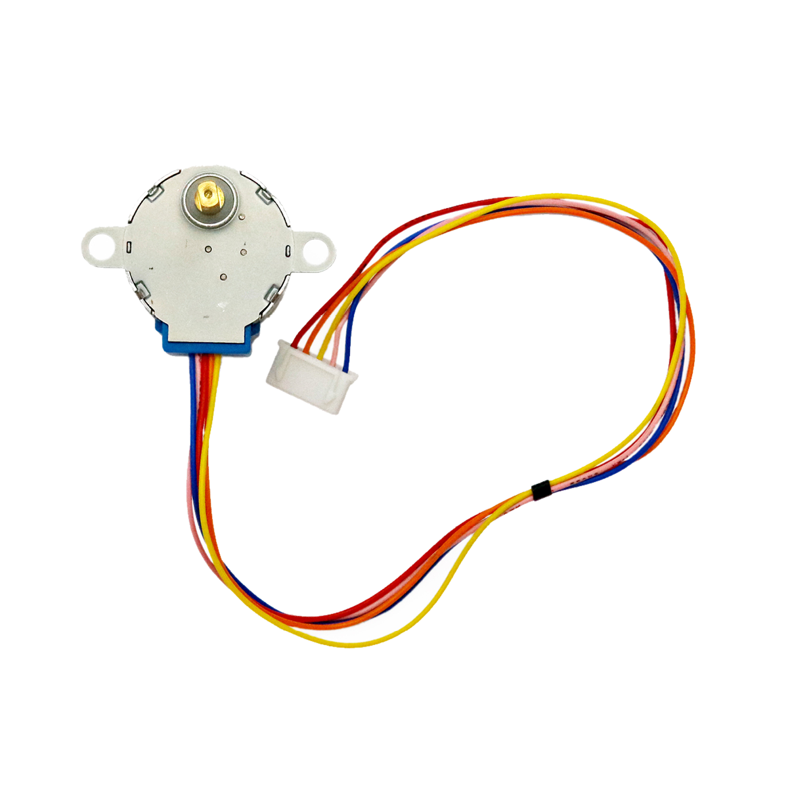

# Schrittmotor

## Beschreibung
Ein Schrittmotor wird immer mithilfe eines Motortreibers angesteuert. Er kann sehr genau positioniert werden, selbst ohne Sensoren, da er in einzelnen, unabhängig von äußeren Belastungen, immer gleichbleibenden Schritten weiterdreht (innerhalb der angegeben Belastungsgrenze). Praktisch bedeutet das: Der Mikrocontroller sendet an den Motortreiber die Richtung und die Anzahl an Schritten, die weitergedreht werden sollen. Solange man die Anfangsposition kennt und den Überblick der vorwärts und rückwärts gedrehten Schritten behält, ist die Position des Motors bekannt. Der Schrittmotor ist dadurch sehr präzise aber oftmals nicht so schnell wie ein einfacher DC-Motor.

Weitere Informationen bezüglich der Ansteuerung sind beim Motortreiber zusammengefasst.

Ein Schrittmotor kommt durch seine genaue und einfache Positionierbarkeit oftmals in der Bewegung von Maschinen oder Roboters zum Einsatz.

Alle weiteren Hintergrundinformationen, sowie ein Beispielaufbau und alle notwendigen Programmbibliotheken findet man über alle gängigen Suchmaschinen durch die Eingabe der genauen Komponentenbezeichnungen.

## Beispiele

!!!show-examples:./examples/

<!-- infolist -->

 

@[youtube](https://www.youtube.com/watch?v=wVxcmO2YuxA)

 

## Wichtige Links für die ersten Schritte:

- [Adafruit Schrittmotor](https://www.adafruit.com/product/858)
- [Seeed Studio Wiki – Motortreiber](http://wiki.seeedstudio.com/Grove-I2C_Motor_Driver_V1.3/)

## Projektbeispiele:

- [Funduino - Schrittmotor](https://funduino.de/nr-15-schrittmotor)

## Weiterführende Hintergrundinformationen:

- [GPIO - Wikipedia Artikel](https://de.wikipedia.org/wiki/Allzweckeingabe/-ausgabe)
- [Schrittmotor - Wikipedia Artikel](https://de.wikipedia.org/wiki/Schrittmotor)

